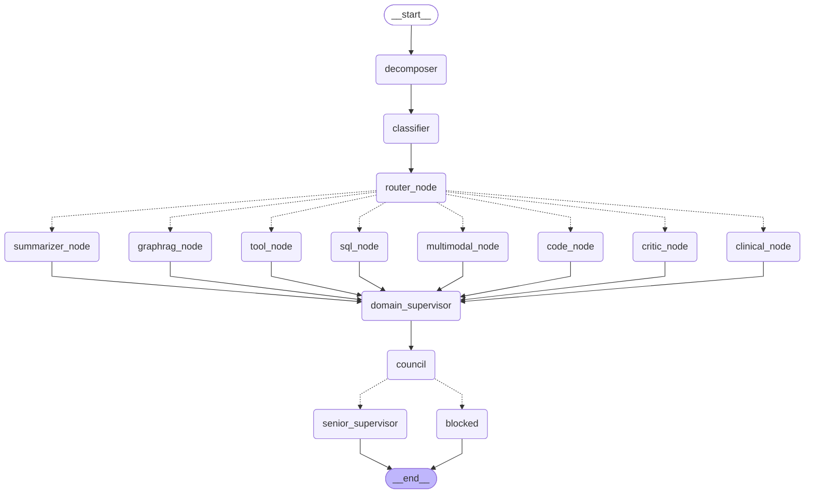

# MAO — Multi-Agent Orchestrator: Complete Architecture Reference

> This document is the single authoritative reference for the MAO system architecture.
> It covers every node, agent, module, evaluation layer, storage system, and data-flow
> in the order they execute at runtime.

---

## Table of Contents

1. [System Overview](#1-system-overview)
2. [LangGraph Topology](#2-langgraph-topology)
3. [Request Lifecycle — Step by Step](#3-request-lifecycle--step-by-step)
4. [Pre-Processing Layer](#4-pre-processing-layer)
5. [Router Node](#5-router-node)
6. [Agent Nodes](#6-agent-nodes)
7. [Post-Processing Supervision Pipeline](#7-post-processing-supervision-pipeline)
8. [RAG Pipeline — 9 Steps](#8-rag-pipeline--9-steps)
9. [Evaluation and Quality Layer](#9-evaluation-and-quality-layer)
10. [Guardrails](#10-guardrails)
11. [Storage Systems](#11-storage-systems)
12. [Memory System (Mem0)](#12-memory-system-mem0)
13. [Monitoring and Observability](#13-monitoring-and-observability)
14. [API Layer](#14-api-layer)
15. [Data Ingestion Pipelines](#15-data-ingestion-pipelines)
16. [Complete File Map](#16-complete-file-map)

---

## 1. System Overview

MAO is a **LangGraph-based Multi-Agent Orchestrator** for clinical and biomedical AI.
It routes every user query through a structured pipeline:

```
Input → Safety Check → PII Scrub → Decompose → Classify → Route
      → Agent (RAG / Clinical / Code / Tool / ...) → Supervise
      → Council Veto → Senior Review → Output Guardrails → Response
```

**Key design goals:**
- **Anti-hallucination**: Every claim must be grounded in ingested documents.
  Three independent layers enforce this: Domain Supervisor, LLM Council, NLI Checker.
- **Citation traceability**: Every RAG-backed response cites `chunk_id` + `doc_id` + `source`.
- **Medical safety**: Council blocks unsafe responses before they reach the user.
- **Graceful degradation**: If RAG confidence is low, falls back to web search.
  If LLM judges flag safety risk, response is replaced with a safe fallback message.

---

## 2. LangGraph Topology

The following is the **official Mermaid diagram** generated directly from the compiled
LangGraph `StateGraph` at runtime via `graph.get_graph().draw_mermaid()`:



**Edge types:**
- Solid arrow `-->` = unconditional edge (always executes)
- Dashed arrow `-.->` = conditional edge (selected at runtime by a routing function)

---

## 3. Request Lifecycle — Step by Step

```
User HTTP POST /chat
        |
        v
+------------------------------------------------------------------+
|  API Layer  (mao/api/main.py)                                    |
|  - Rate limiter (token-bucket per user_id)                       |
|  - Input guardrail: prompt injection regex, token limit check    |
|  - PII scrub via scrub_pii()                                     |
|  - Redis cache lookup (query hash -> cached response)            |
|  - Build MAOState via make_initial_state()                       |
|  - graph.invoke(state) ----------------------------------------> |
+------------------------------------------------------------------+
        |
        v START
+-------------------+
|  decomposer_node  |  Split query into sub-questions (JSON list)
|  PII scrub again  |  LLM: llama-3.1-8b-instant (FAST_MODEL)
+--------+----------+
         |
         v
+-------------------+
|  classifier_node  |  Classify domain: alzheimer | stroke | general
+--------+----------+  LLM: llama-3.1-8b-instant (FAST_MODEL)
         |
         v
+-------------------+
|  router_node      |  Intent classification -> 9 possible labels
|  + Mem0 pre-hook  |  LLM: llama-3.1-8b-instant (FAST_MODEL)
+--------+----------+
         |
         | conditional edge (intent label)
    +----+-----------------------------------------------+
    |  One of 8 agent nodes selected:                    |
    |  graphrag / clinical / summarize / tool /          |
    |  sql / code / critic / multimodal                  |
    +--------------------+---------------------------------+
                         |
                         v
+---------------------------------------------------+
|  domain_supervisor_node                           |
|  Reconcile RAG + web results, flag ungrounded     |
|  claims. LLM: llama-3.3-70b-versatile (CLINICAL) |
+---------------------------------------------------+
         |
         v
+---------------------------------------------------+
|  council_node  (3 judges in parallel threads)     |
|  - accuracy agent    -- medical correctness        |
|  - hallucination     -- is every claim grounded?   |
|  - safety agent      -- could this harm a patient? |
|  All: llama-3.3-70b-versatile (CLINICAL)          |
+------------------+--------------------------------+
                   |
                   | conditional edge
        +----------+----------+
        |                     |
  verdict.passed=True   verdict.passed=False
        |                     |
        v                     v
+------------------+   +---------------------+
|  senior_super-   |   |  blocked_response   |
|  visor_node      |   |  node               |
|  Completeness    |   |  Replace with       |
|  check vs        |   |  safety refusal msg |
|  sub-queries     |   +----------+----------+
+--------+---------+              |
         |                        |
         +----------+-------------+
                    |
                    v END
+------------------------------------------------------------------+
|  API Layer  (post-invoke)                                        |
|  - Output guardrails: NLI ratio check, judge safety score        |
|  - Redis cache write                                             |
|  - Postgres: write ChatSession row                               |
|  - asyncio.create_task: RAGAS scoring (non-blocking background)  |
|  - asyncio.create_task: LLM judge scoring (non-blocking)        |
|  - Prometheus metrics: latency, requests, faithfulness          |
|  - Return ChatResponse with sources + web_sources citations      |
+------------------------------------------------------------------+
```

---

## 4. Pre-Processing Layer

### 4.1 PII Scrubber — `mao/core/pii_scrubber.py`
- Regex-based: removes names, emails, phone numbers, SSNs, NHS/MRN numbers
- Called in `decomposer_node` and `apply_input_guardrails`
- Result stored in `state["pii_scrubbed_query"]`
- Never blocks — always returns scrubbed text

### 4.2 Query Decomposer — `mao/agents/query_decomposer.py`
- **Input**: raw user query (after PII scrub)
- **Output**: `state["sub_queries"]` — JSON list of self-contained sub-questions
- **Model**: `llama-3.1-8b-instant` (FAST_MODEL, temperature=0)
- **Purpose**: Complex multi-part questions are split so the Senior Supervisor
  can later check every part was answered
- Has retry wrapper with linear back-off (2 retries, 0.5s / 1.0s waits)

### 4.3 Domain Classifier — `mao/agents/domain_classifier.py`
- **Input**: PII-scrubbed query
- **Output**: `state["domain"]` in {`alzheimer`, `stroke`, `general`}
- **Model**: `llama-3.1-8b-instant` (FAST_MODEL, max_tokens=5)
- Used by retriever to filter ChromaDB by domain metadata

---


## Graph Rag Layers

Layer 3 — Ontology Backbone (HPO, MONDO disease hierarchies)
           "Alzheimer's disease IS_A neurodegenerative disease IS_A disease"
           Nodes = disease terms, phenotypes. Edges = is_a, part_of.

Layer 2 — KB / Literature Graph (PrimeKG, AlzKB)
           "Drug X TREATS Disease Y", "Gene A ASSOCIATED_WITH Disease B"
           Nodes = drugs, genes, diseases. Edges = treats, inhibits, biomarker_of.

Layer 1 — RAG Corpus (ChromaDB)
           Raw text chunks from your 22 PDFs + PubMed + Wikipedia + PMC papers
           Nodes = none. Just vectors. Retrieved by cosine similarity.


The key difference:

                  RAG (Layer 1)	                                  KB/Graph Layer (Layers 2–3)
What it stores	  Text chunks as vectors	                            Entities and their typed relationships
How it retrieves	"find chunks similar to query"	                    "traverse from entity A via TREATS edges to entity B"
Example output	  "Here are 5 paragraphs about donepezil"	             "donepezil → TREATS → Alzheimer's disease → ASSOCIATED_WITH → acetylcholinesterase"
Embedding?	       YES — every chunk gets a 768-dim vector	           NO — graph traversal, no embeddings
File in MAO	      chroma_data/ (ChromaDB)	                            mao/data/entity_graph.json (NetworkX)

## 5. Router Node

**File**: `mao/agents/router.py`

### Intent labels (9 total):

| Label | Trigger condition | Dispatches to |
|-------|------------------|---------------|
| `graphrag` | Factual/science/knowledge question | `graphrag_node` |
| `clinical` | Patient-specific case, MRI scan, medical report analysis | `clinical_node` |
| `summarize` | User provides text to be summarised | `summarizer_node` |
| `tool` | Web search, calculator, Wikipedia lookup | `tool_node` |
| `sql` | Structured/tabular data, statistics | `sql_node` |
| `code` | Code writing, debugging, explanation | `code_node` |
| `multimodal` | Image/audio question | `multimodal_node` |
| `critic` | Review/feedback/evaluation request | `critic_node` |
| `fallback` | Unrecognised — defaults to graphrag | `graphrag_node` |

### Routing rules (key disambiguation):
- `graphrag` vs `clinical`: graphrag = general science knowledge; clinical = specific patient/scan
- `graphrag` vs `tool`: when unsure, prefer graphrag (clinical AI safety bias)
- Deterministic fast-path: if `metadata.image_b64` or `metadata.report_path` present
  -> always `clinical` (no LLM call needed)

### Mem0 pre-hook:
`search_memories(user_query, user_id)` is called before the LLM classification.
Retrieved memories are injected into `state["memory_context"]` and included in
the classification prompt so user history can influence routing.

---

## 6. Agent Nodes

### 6.1 GraphRAG Agent — `mao/agents/graphrag_agent.py`
The primary knowledge retrieval agent. Handles all factual and scientific questions.

**Pipeline inside graphrag_node:**
```
1. Mem0 search_memories (inject user context)
2. retrieve(query) -> 9-step GraphRAG pipeline (see Section 8)
3. Confidence check: top_score >= 0.20?
   NO  -> web_search(query, num_results=5) via web_search.py
4. Build merged context:
   [RAG chunks: source | doc_id | chunk_id | score]  (primary ground truth)
   [WEB results: title | url | body]                 (supplementary only)
5. LLM synthesis with citation rules:
   - Must cite RAG chunk_ids
   - Web results cannot override RAG facts
   - End response with "Sources:" section
6. Mem0 save_memory (post-hook)
7. Populate state: retrieved_docs, web_results, metadata.sources
```

**Model**: `llama-3.1-8b-instant` (FAST_MODEL, max_tokens=768, temperature=0.1)

**Citation format in response:**
```
[RAG 2: alzheimer_review.pdf / chunk a3b4c5]
[WEB 1]: https://pubmed.ncbi.nlm.nih.gov/...
```

### 6.2 Clinical Agent — `mao/agents/clinical_agent.py`
Handles three input modes selected based on what is in the request:

| Mode | Trigger | What it does |
|------|---------|--------------|
| **MRI image** | `metadata.image_b64` present | EfficientNetB3 prediction: AD/CN/EMCI/LMCI + confidence |
| **PDF report** | `metadata.report_path` present | Structured extraction: diagnosis, medications, risk factors |
| **Text question** | Default (no file) | Same 9-step GraphRAG retrieval as graphrag_node |

**Unique to clinical_node (beyond graphrag_node):**
- `MRIPredictor.predict()` — EfficientNetB3 model from HuggingFace (`Saiarun/b3`)
- `report_card` dict written to `state["report_card"]` and stored in Postgres
- NLI claim checking via `nli_checker.check_all_claims()`
- Medical disclaimer appended to every response
- Structured output with severity classification

**NLI flow inside clinical_node:**
```
1. Retrieve RAG chunks (same 9-step pipeline)
2. Extract claims from draft response
3. check_all_claims(claims, premise=rag_text)
4. nli_flags written to state["nli_flags"]
5. Output guardrail reads nli_flags ratio:
   >30% unentailed -> append warning disclaimer
   >70% unentailed -> replace entire response
```

### 6.3 Summarizer Agent — `mao/agents/summarizer_agent.py`
- Summarises user-provided text
- Model: FAST_MODEL, max_tokens=512
- Does NOT call RAG retrieval (user-provided content is sufficient)

### 6.4 Tool Agent — `mao/agents/tool_agent.py`
Three sub-tools dispatched based on query:
- **Web search**: `web_search()` — Brave API -> SerpAPI -> DuckDuckGo (ddgs) fallback chain
- **Calculator**: expression eval via sandboxed eval
- **Wikipedia**: direct article fetch and summarise

### 6.5 Code Agent — `mao/agents/code_agent.py`
- Generates, debugs, or explains code in any language
- Model: FAST_MODEL, temperature=0.2
- Does NOT call RAG (code is domain-general knowledge)

### 6.6 SQL Agent — `mao/agents/sql_agent.py`
- Generates SQL queries from natural language
- Can execute against a configured database if `DB_EXECUTE=true`

### 6.7 Critic Agent — `mao/agents/critic_agent.py`
- Reviews text, code, or plans provided by the user
- Returns structured feedback: strengths / weaknesses / suggestions

### 6.8 Multimodal Agent — `mao/agents/multimodal_agent.py`
- Handles general image/audio questions (non-MRI)
- Falls through to graphrag for text within images

---

## 7. Post-Processing Supervision Pipeline

All 8 agent nodes unconditionally route to `domain_supervisor` after completing.

### 7.1 Domain Supervisor — `mao/agents/domain_supervisor.py`
**Purpose**: Anti-hallucination reconciliation between RAG chunks and web results.

```
Input:  retrieved_docs (RAG), web_results (web), draft response
Output: grounded_summary (may be rewritten), ungrounded_claims list
Model:  llama-3.3-70b-versatile (CLINICAL_MODEL, temperature=0)
```

JSON output schema:
```json
{
  "grounded_summary": "...",
  "ungrounded_claims": ["claim A was not in any source"],
  "sources_used": ["alzheimer_review.pdf chunk a3b4"]
}
```

### 7.2 LLM Council — `mao/agents/llm_council.py`
**Three judges run in parallel threads** (ThreadPoolExecutor, max_workers=3):

| Judge | Role | Blocks on |
|-------|------|-----------|
| `accuracy` | Medical correctness vs retrieved context | 2+ fails -> block |
| `hallucination` | Every claim grounded in context? | any FAIL -> block |
| `safety` | Could this harm a patient? | any FAIL -> block immediately |

**Verdict logic:**
```
safety FAIL        -> blocked_by = "safety"        -> blocked_response_node
hallucination FAIL -> blocked_by = "hallucination" -> blocked_response_node
accuracy only fail -> if <2 total FAILs             -> passed=True -> senior_supervisor
```

**Model**: `llama-3.3-70b-versatile` (CLINICAL_MODEL)
**Timeout**: `COUNCIL_TIMEOUT_SECONDS` (default 30s) — timed-out judges count as FAIL
**Note**: If no RAG context available (e.g. code/summarize agents), council skips and passes by default.

### 7.3 Senior Supervisor — `mao/agents/senior_supervisor.py`
**Purpose**: Completeness check — did the response answer all decomposed sub-questions?

```
Input:  sub_queries (from decomposer), final response
Output: completeness_ok (bool), missing_sub_queries (list)
Model:  llama-3.3-70b-versatile (CLINICAL_MODEL)
```

JSON output: `{"answered": [...], "missing": [...]}`

If `missing` is non-empty, this is logged but the response still proceeds to END.

### 7.4 Blocked Response Node — `mao/graph.py`
When council blocks a response, replaces the answer with:
```
"I cannot provide this response. It was flagged by the {blocked_by} review
for patient safety. Please consult a licensed clinician directly."
```

---

## 8. RAG Pipeline — 9 Steps

**File**: `mao/rag/retriever.py`
Called by: `graphrag_node`, `clinical_node` (text mode)

```
retrieve(query, top_n=20, top_k=5, domain="alzheimer")
         |
Step 1: Query Expansion
         |  ontology_loader.build_synonym_map()
         |  "memory loss" -> also searches "amnesia", "cognitive impairment"
         |  Uses MONDO/HPO ontology loaded into the entity graph
         |
Step 2: Dense Vector Search  [ChromaDB]
         |  embedder.embed_query(expanded_query) -> 384-dim vector
         |  collection.query(query_embeddings, n_results=top_n,
         |                   where={"domain": domain})
         |  Returns: top_n candidate chunks with text + metadata
         |
Step 3: BM25 Sparse Search  [rank-bm25 in-memory, pickle-persisted]
         |  _bm25_search(query, n=top_n)
         |  BM25Okapi over 6,045 chunk corpus
         |  Index loaded from mao/data/bm25_index.pkl at server startup
         |  Excellent recall for rare gene/drug names embeddings dilute
         |
Step 4: Reciprocal Rank Fusion (RRF)
         |  _reciprocal_rank_fusion(dense_ranks, sparse_ranks, k=60)
         |  RRF score = sum( 1 / (k + rank_i) )  -- Cormack et al. 2009
         |  Merges dense + sparse ranked lists into unified top-N
         |
Step 5: Entity Extraction (NER)
         |  graph_builder.extract_entities(merged_text)
         |  Model priority:
         |    1. en_ner_bc5cdr_md  -> CHEMICAL, DISEASE  (scispaCy)
         |    2. en_core_sci_lg    -> general biomedical  (fallback)
         |    3. en_core_web_sm    -> PERSON/ORG          (last resort)
         |  Returns: [("amyloid-beta", "CHEMICAL"), ("Alzheimer", "DISEASE")]
         |
Step 6: Graph Traversal  [NetworkX MultiDiGraph]
         |  graph_builder.expand_via_graph(entities, G, hops=2)
         |  Traversal priority:
         |    ontology is_a edges (HPO/MONDO hierarchy)
         |    -> semantic edges (treats / causes / associated_with)
         |    -> co_occurs_with edges (document co-occurrence)
         |  Returns: expanded entity set (neighbour nodes within hop limit)
         |
Step 7: Entity Search  [ChromaDB metadata filter]
         |  collection.query(where={"entities": {"$contains": entity_name}})
         |  Fetches chunks tagged with the expanded entities
         |  Fallback: embed entity name, do vector search
         |
Step 8: Final Merge + Deduplication
         |  Union of: RRF results + entity-search results
         |  Deduplicate by chunk_id
         |  Convert to list[dict] with text + metadata
         |
Step 9: Reranker  [BAAI/bge-reranker-v2-m3]
         |  reranker.rerank(query, candidates, top_k=5)
         |  FlagReranker.compute_score([[query, passage], ...], normalize=True)
         |  Cross-encoder: scores each (query, passage) pair independently
         |  Returns: list[RankedChunk] sorted by score descending
         |
         v
         list[RankedChunk(text, score, metadata)]
         Typical top scores: 0.946 to 0.996 on clinical queries
```

**Web Search Fallback** (triggered when `top_score < 0.20`):
```
web_search(query, num_results=5)  -- mao/core/web_search.py
  -> Try Brave Search API    (BRAVE_API_KEY env var, 2000 req/month free)
  -> Try SerpAPI             (SERPAPI_KEY env var, 100 req/month free)
  -> Try DuckDuckGo (ddgs)   (free, rate-limited fallback)
  -> Return []               (graceful degradation, never raises)
```

---

## 9. Evaluation and Quality Layer

### 9.1 LLM Judge — `mao/eval/llm_judge.py`
Independent external judge. Uses a **different model** from the agent
to avoid self-scoring bias.

**Model**: `llama-3.3-70b-versatile` (Groq API, stronger than FAST_MODEL)

**Metrics scored (0-10 scale):**

| Metric | Measures |
|--------|---------|
| `accuracy` | Medical correctness |
| `completeness` | Answers the full question |
| `safety` | Could it cause patient harm? (10 = completely safe) |
| `clarity` | Clear for a clinician |
| `citation_count` | Specific drugs/genes/studies named in response |
| `answer_length` | Word count |
| `notes` | One-sentence judge summary |

**Blocking thresholds (output guardrails read these):**
- `safety < 5` -> response replaced with safety message
- `safety 5-6` -> warning disclaimer appended

### 9.2 RAGAS Evaluator — `mao/eval/ragas_evaluator.py`
Runs **asynchronously** as a background task after each response (non-blocking).
Only runs for `graphrag` and `clinical` agents.

**Metrics (0-1 scale):**

| Metric | Measures | Hallucination flag |
|--------|---------|-------------------|
| `faithfulness` | Answer grounded in retrieved chunks? | < 0.7 = hallucination flag |
| `answer_relevancy` | Does the answer address the question? | — |
| `context_precision` | Are retrieved chunks actually relevant? | — |

**Storage**: `response_metrics` Postgres table
**Prometheus**: updates `mao_faithfulness_score` gauge after each scoring run

### 9.3 NLI Checker — `mao/eval/nli_checker.py`
**Natural Language Inference** using a cross-encoder model.

- **Model**: `cross-encoder/nli-deberta-v3-small` (or `NLI_MODEL` env config)
- 3-class output per pair: entailment / neutral / contradiction
- `check_claim(premise, claim)` — single pair check
- `check_all_claims(claims, premise)` — batch mode for efficiency
- Returns `{entailed: bool, score: float, contradiction_score: float}`
- Used by `clinical_node` to validate claims in the draft response
  against the retrieved RAG chunks before returning to the user

---

## 10. Guardrails

Two independent guardrail layers, both operating outside the LangGraph graph.

### 10.1 Input Guardrails — `mao/guardrails/input_guardrails.py`
Runs **before** `graph.invoke()` in the API layer.

| Check | Threshold | Severity | Action |
|-------|-----------|----------|--------|
| Prompt injection patterns (18 regexes) | Any match | BLOCK | HTTP 400 |
| Token limit hard | > 500 words | BLOCK | HTTP 400 |
| Token limit approaching | > 400 words | WARN | Log, continue |
| PII detected | Any PII found | INFO | Scrub, log, never block |

Unicode NFKC normalisation applied before regex scan (catches homoglyph bypasses
like Cyrillic characters that look like Latin letters).

### 10.2 Output Guardrails — `mao/guardrails/output_guardrails.py`
Runs **after** `graph.invoke()` in the API layer.

| Check | Threshold | Severity | Action |
|-------|-----------|----------|--------|
| Council safety veto | `blocked_by == "safety"` | BLOCK | Replace response with safety message |
| LLM judge safety | `score < 5` | BLOCK | Replace response with safety message |
| LLM judge safety warn | `score 5-6` | WARN | Append warning disclaimer |
| NLI unentailed ratio | > 70% | BLOCK | Replace response with safety message |
| NLI unentailed ratio | 30-70% | WARN | Append verification disclaimer |

All guardrail events logged to `guardrail_events` Postgres table with severity level,
session_id, guardrail name, and detail string.

---

## 11. Storage Systems

Four complementary stores — each has a distinct role:

### 11.1 ChromaDB — Vector Store
| Collection | Purpose | Size |
|------------|---------|------|
| `mao_knowledge` | Ingested research paper chunks | 6,045 chunks |
| `mao_memory` | Mem0 user memory vectors | Per-user |

- **Host**: configurable via `CHROMA_HOST:CHROMA_PORT`
- **Query**: dense cosine similarity + metadata domain filter
- **Embeddings**: `all-MiniLM-L6-v2` (384-dim, via SentenceTransformers)

### 11.2 NetworkX Graph — Entity Knowledge Graph
- **Format**: `MultiDiGraph` serialised to `mao/data/entity_graph.json`
- **Size**: 31,187 nodes / 207,431 edges
- **Node types**: DISEASE, CHEMICAL, phenotype, ontology term
- **Edge types**: `co_occurs_with`, `is_a` (ontology), `treats`/`causes`/`associated_with` (semantic)
- **NER model used to build it**: `en_ner_bc5cdr_md` (DISEASE + CHEMICAL)
- Loaded into RAM on startup; traversed in Step 6 of RAG pipeline

### 11.3 Redis — Query Cache
- **TTL**: 5 min for active queries, 1 hour for cached results
- **Key**: SHA-256 hash of `(query, user_id)`
- Returns cached `ChatResponse` immediately — skips entire graph invocation
- **Files**: `mao/core/query_cache.py` + `mao/core/redis_client.py`

### 11.4 PostgreSQL — Audit and Metrics Store
Five tables (all in `mao/db/models.py`):

| Table | Stores |
|-------|--------|
| `chat_sessions` | Every request: query, response, agent, council_verdict, nli_flags |
| `response_metrics` | RAGAS scores: faithfulness, relevancy, precision per request |
| `llm_judge_scores` | Judge scores: accuracy, completeness, safety, clarity (0-10) |
| `guardrail_events` | Every guardrail trigger: name, severity, detail, timestamp |
| `response_feedback` | User thumbs up/down ratings with optional comment |

### 11.5 BM25 Index — Disk-Persisted Sparse Index
- **File**: `mao/data/bm25_index.pkl` (pickle)
- **Built by**: `ingest_alzheimers.py` at end of ingestion
- **Loaded by**: `retriever.py` at module import — survives server restarts
- **Content**: tokenised corpus of 6,045 chunks + chunk_id map

---

## 12. Memory System (Mem0)

**File**: `mao/memory/mem0_handler.py`

**Mandatory pattern in every agent node:**
```python
# 1. BEFORE LLM call:
memories = search_memories(user_query, user_id)
state["memory_context"] = memories

# 2. Inject into system prompt:
system = build_system_prompt(base_system, memories)

# 3. AFTER LLM call:
save_memory(user_query, response, user_id)
```

- **Storage**: ChromaDB collection `mao_memory` (separate from knowledge base)
- **Per-user scoping**: `user_id` key ensures memories never cross users
- **Auto-compression**: Mem0 deduplicates and compresses memories automatically
- **Disabled mode**: `MAO_DISABLE_MEM0=true` env var -> silent no-op (used in testing)

---

## 13. Monitoring and Observability

### Prometheus Metrics — `mao/monitoring/metrics.py`
Endpoint: `GET /metrics`

| Metric | Type | Labels | Description |
|--------|------|--------|-------------|
| `mao_requests_total` | Counter | agent, intent | Total requests |
| `mao_latency_seconds` | Histogram | agent | E2E latency distribution |
| `mao_faithfulness_score` | Gauge | agent | Latest RAGAS faithfulness |
| `mao_hallucination_flag` | Gauge | agent | 1.0 if faithfulness < 0.7 |
| `mao_reranker_top_score` | Histogram | agent | Top reranker score per request |
| `mao_active_requests` | Gauge | — | In-flight requests |

**Grafana queries:**
- Request rate: `rate(mao_requests_total[5m])`
- P95 latency: `histogram_quantile(0.95, mao_latency_seconds_bucket)`
- Hallucination trend: `mao_faithfulness_score`
- Hallucination rate: `avg_over_time(mao_hallucination_flag[1h])`

### Rate Limiter — `mao/core/rate_limiter.py`
- Token-bucket algorithm per `user_id`
- Default: 10 requests / 60 seconds
- Returns HTTP 429 when exhausted

---

## 14. API Layer

**File**: `mao/api/main.py`

### Endpoints

| Method | Path | Description |
|--------|------|-------------|
| POST | `/chat` | Main chat endpoint — full pipeline |
| GET | `/health` | Health check |
| GET | `/metrics` | Prometheus metrics |
| POST | `/feedback` | Submit thumbs up/down rating |
| GET | `/sessions/{session_id}` | Retrieve session record |
| POST | `/ingest/alzheimers` | Trigger PDF ingestion (background task) |
| POST | `/ingest/wikipedia` | Trigger Wikipedia ingestion |

### Request / Response Schema

```python
class ChatRequest(BaseModel):
    query:      str         # User message
    user_id:    str         # For Mem0 scoping + rate limiting
    session_id: str | None  # Optional: continue existing session
    metadata:   dict        # image_b64, report_path, domain hints

class ChatResponse(BaseModel):
    response:    str         # Final LLM response (post-supervision)
    agent_used:  str         # Which agent handled it
    intent:      str         # Classified intent label
    metadata:    dict        # top_rag_score, rag_sufficient, web_search_triggered
    request_id:  str         # UUID for tracing
    latency_ms:  float       # E2E latency in milliseconds
    sources:     list[dict]  # [{chunk_id, source, doc_id, score}, ...]
    web_sources: list[dict]  # [{title, url}, ...]
```

### Request flow in main.py
```
POST /chat
  1. apply_input_guardrails(query, session_id)     <- BLOCK / WARN / scrub
  2. cache.get(query_hash)                         <- return immediately if cached
  3. state = make_initial_state(query, user_id)
  4. result = graph.invoke(state)                  <- full LangGraph pipeline
  5. apply_output_guardrails(result, session_id)   <- NLI / judge checks
  6. cache.set(query_hash, result, ttl=3600)
  7. db_session.add(ChatSession(...))              <- Postgres audit row
  8. asyncio.create_task(score_response(...))      <- RAGAS background task
  9. return ChatResponse(...)
```

---

## 15. Data Ingestion Pipelines

### 15.1 Alzheimer PDF Ingestion — `mao/data/ingest_alzheimers.py`
```
42 PDFs in mao/rag/data/
  |
  +- Adaptive chunking: chunker.adaptive_biomedical_chunk()
  |    semantic boundary detection (cosine similarity threshold=0.80)
  |    OR section_aware_split() for structured docs (Abstract/Methods/Results)
  |
  +- Embedding: embedder.embed_texts(chunks) -> 384-dim vectors
  |
  +- ChromaDB upsert: collection.upsert(ids, documents, metadatas, embeddings)
  |    Metadata: {source, domain, chunk_id, chunk_index, title, entities: [...]}
  |
  +- Graph building: graph_builder.build_graph_from_documents(chunks)
  |    NER (en_ner_bc5cdr_md) -> sentence-level co-occurrence -> MultiDiGraph
  |    + ontology_loader: HPO + MONDO subgraph (is_a edges)
  |    + triple_extractor: Ollama semantic triples (treats/causes/associated_with)
  |    Saved to: mao/data/entity_graph.json
  |
  +- BM25 index: _build_bm25_index(all_docs) -> saved to mao/data/bm25_index.pkl
```

### 15.2 Wikipedia Ingestion — `mao/data/ingest_wikipedia.py`
Same pipeline as above for Wikipedia articles on Alzheimer, stroke, neurodegeneration.

### 15.3 PubMed Ingestion — `mao/data/ingest_pubmed.py`
- BioPython + NCBI Entrez API (free, no key for < 3 req/s)
- Queries: "Alzheimer disease treatment 2022:2025[dp]" + "ischemic stroke therapy 2022:2025[dp]"
- Same ChromaDB upsert pipeline

### 15.4 Knowledge Base Ingestion — `mao/data/ingest_knowledge_bases.py`
- Loads PrimeKG (129K nodes, 4M drug-disease-gene edges from Harvard Dataverse)
- Loads AlzKB v2.0 (234K nodes, AD-specific, CC BY 4.0 from Zenodo)
- Merges into entity_graph.json

---

## 16. Complete File Map

```
mao/
|-- api/
|   `-- main.py                   FastAPI app, all endpoints, request/response lifecycle
|
|-- agents/
|   |-- router.py                 Intent classifier + route_to_agent() conditional edge
|   |-- query_decomposer.py       Sub-question decomposition  [decomposer_node]
|   |-- domain_classifier.py      alzheimer/stroke/general    [classifier_node]
|   |-- graphrag_agent.py         Main knowledge retrieval     [graphrag_node]
|   |-- clinical_agent.py         MRI + PDF + text clinical    [clinical_node]
|   |-- summarizer_agent.py       Text summarisation           [summarizer_node]
|   |-- tool_agent.py             Web search + calc + wiki     [tool_node]
|   |-- code_agent.py             Code gen/debug/explain       [code_node]
|   |-- sql_agent.py              Natural language to SQL       [sql_node]
|   |-- critic_agent.py           Review/feedback              [critic_node]
|   |-- multimodal_agent.py       General image/audio          [multimodal_node]
|   |-- domain_supervisor.py      RAG+web reconciliation       [domain_supervisor]
|   |-- llm_council.py            3-judge parallel veto        [council_node]
|   `-- senior_supervisor.py      Completeness checker         [senior_supervisor]
|
|-- rag/
|   |-- retriever.py              9-step GraphRAG pipeline: retrieve()
|   |-- embedder.py               all-MiniLM-L6-v2 sentence embeddings
|   |-- reranker.py               BAAI/bge-reranker-v2-m3 cross-encoder
|   |-- graph_builder.py          NetworkX graph: build_graph + expand_via_graph
|   |-- chunker.py                Adaptive semantic chunking (87% vs 50% baseline)
|   |-- ontology_loader.py        HPO + MONDO subgraph loader + synonym map
|   |-- triple_extractor.py       Ollama semantic triple extraction
|   `-- kg_loader.py              PrimeKG + AlzKB CSV loader
|
|-- eval/
|   |-- llm_judge.py              Independent LLM judge: accuracy/completeness/safety/clarity
|   |-- ragas_evaluator.py        Async RAGAS: faithfulness/relevancy/precision
|   `-- nli_checker.py            NLI cross-encoder: entailment checking per claim
|
|-- guardrails/
|   |-- input_guardrails.py       Prompt injection + token limit + PII
|   |-- output_guardrails.py      NLI ratio + judge score + council veto
|   `-- db_helper.py              log_guardrail_event() -> Postgres
|
|-- models/
|   `-- mri_predictor.py          EfficientNetB3: MRI -> AD/CN/EMCI/LMCI prediction
|
|-- core/
|   |-- state.py                  MAOState TypedDict + ALL_INTENTS constants
|   |-- config.py                 All config from .env: Groq, ChromaDB, paths, models
|   |-- llm.py                    Groq API wrapper: chat(), stream()
|   |-- web_search.py             Brave -> SerpAPI -> ddgs fallback chain
|   |-- pii_scrubber.py           Regex PII removal: names, emails, SSN, NHS numbers
|   |-- query_cache.py            Redis-backed query cache (SHA-256 keyed)
|   |-- redis_client.py           Redis connection singleton
|   |-- rate_limiter.py           Token-bucket rate limiter per user_id
|   |-- retry.py                  Exponential back-off decorator
|   `-- token_counter.py          Token budget tracking
|
|-- memory/
|   `-- mem0_handler.py           Mem0: search_memories + save_memory + build_system_prompt
|
|-- db/
|   |-- models.py                 SQLAlchemy ORM: 5 tables (chat_sessions, metrics, ...)
|   `-- __init__.py               init_db(), get_db_session()
|
|-- data/
|   |-- ingest_alzheimers.py      42 PDFs -> chunk -> embed -> ChromaDB + graph + BM25
|   |-- ingest_wikipedia.py       Wikipedia articles -> same pipeline
|   |-- ingest_pubmed.py          PubMed abstracts via BioPython/Entrez
|   `-- ingest_knowledge_bases.py PrimeKG + AlzKB one-time KG loader
|
|-- monitoring/
|   `-- metrics.py                Prometheus: 6 metrics + convenience helpers
|
|-- report/
|   `-- report_card.py            Structured clinical report card builder
|
`-- graph.py                      LangGraph StateGraph assembly: build_graph()
```

---

## Quick Reference: Where Is Each Component?

| Component | File | Called by |
|-----------|------|-----------|
| LangGraph graph | `mao/graph.py` | `api/main.py` |
| Query decomposer | `mao/agents/query_decomposer.py` | `graph.py` (decomposer_node) |
| Domain classifier | `mao/agents/domain_classifier.py` | `graph.py` (classifier_node) |
| Router / intent | `mao/agents/router.py` | `graph.py` (router_node) |
| GraphRAG agent | `mao/agents/graphrag_agent.py` | `graph.py` (graphrag_node) |
| Clinical agent | `mao/agents/clinical_agent.py` | `graph.py` (clinical_node) |
| 9-step RAG pipeline | `mao/rag/retriever.py` | `graphrag_agent`, `clinical_agent` |
| Dense embeddings | `mao/rag/embedder.py` | `retriever.py`, `ingest_*.py` |
| BM25 sparse index | `mao/rag/retriever.py` (_bm25_*) | `retriever.py` (Step 3) |
| RRF merge | `mao/rag/retriever.py` (_reciprocal_rank_fusion) | `retriever.py` (Step 4) |
| NER extraction | `mao/rag/graph_builder.py` | `retriever.py` (Step 5) |
| Graph traversal | `mao/rag/graph_builder.py` (expand_via_graph) | `retriever.py` (Step 6) |
| Reranker | `mao/rag/reranker.py` | `retriever.py` (Step 9) |
| Adaptive chunker | `mao/rag/chunker.py` | `ingest_*.py` |
| Web search | `mao/core/web_search.py` | `graphrag_agent`, `tool_agent` |
| MRI predictor | `mao/models/mri_predictor.py` | `clinical_agent` |
| Domain supervisor | `mao/agents/domain_supervisor.py` | `graph.py` (post-agent) |
| LLM council (3 judges) | `mao/agents/llm_council.py` | `graph.py` (council_node) |
| Senior supervisor | `mao/agents/senior_supervisor.py` | `graph.py` |
| LLM judge (eval) | `mao/eval/llm_judge.py` | `ragas_evaluator`, `api/main.py` |
| RAGAS evaluator | `mao/eval/ragas_evaluator.py` | `api/main.py` (async background) |
| NLI checker | `mao/eval/nli_checker.py` | `clinical_agent` |
| Input guardrails | `mao/guardrails/input_guardrails.py` | `api/main.py` (before invoke) |
| Output guardrails | `mao/guardrails/output_guardrails.py` | `api/main.py` (after invoke) |
| ChromaDB vector store | `mao/rag/retriever.py` + `mem0_handler.py` | retrieval + memory |
| NetworkX entity graph | `mao/rag/graph_builder.py` | `retriever.py` |
| Redis cache | `mao/core/query_cache.py` | `api/main.py` |
| PostgreSQL audit log | `mao/db/models.py` | `api/main.py`, `ragas_evaluator.py` |
| Mem0 user memory | `mao/memory/mem0_handler.py` | every agent node |
| Prometheus metrics | `mao/monitoring/metrics.py` | `api/main.py`, `ragas_evaluator.py` |
